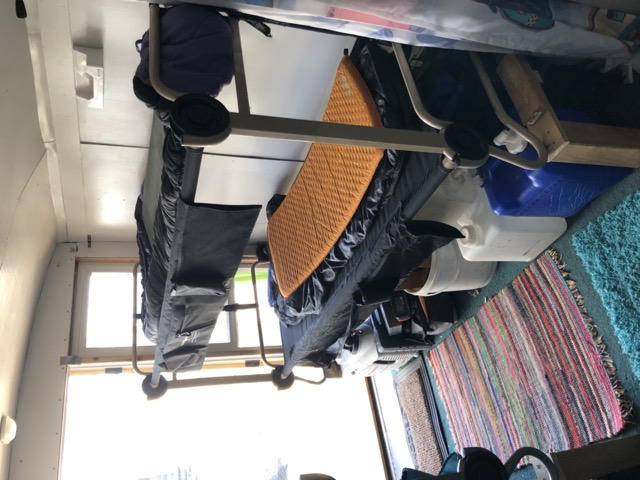
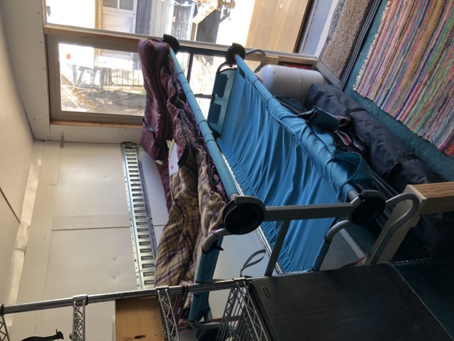
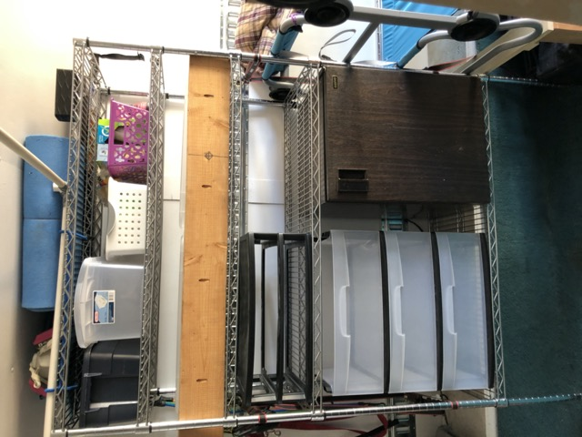
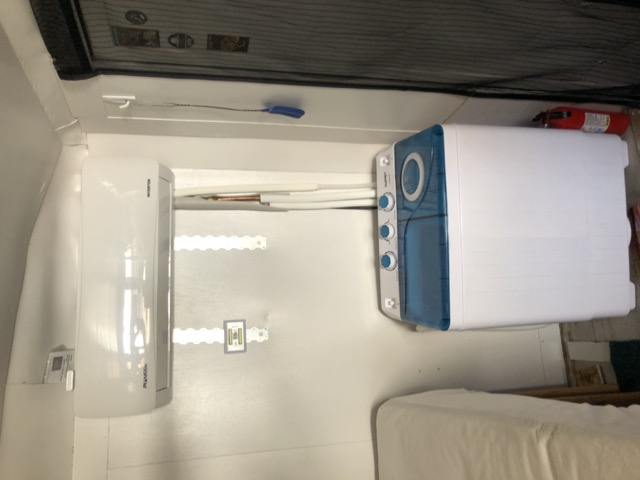
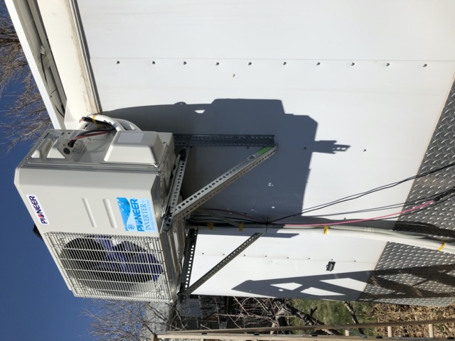
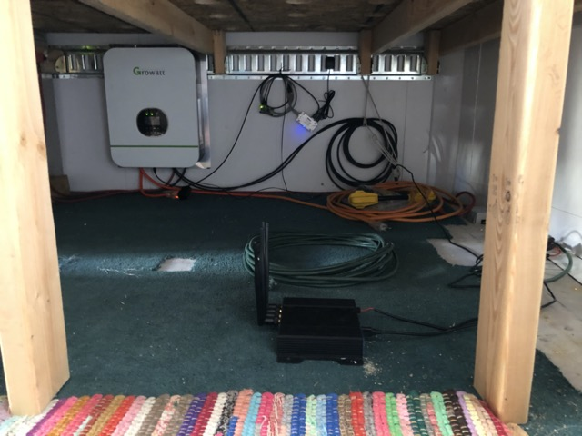

# Trailer Build

## Introduction

It's an 8'x20' car hauler, converted into a travel trailer.

If I could change one thing, I would start with a lighter trailer. Car haulers have massive floor joists which just add unnecessary weight for a travel trailer. However, commercially manufactured travel trailers are poorly built, leak, and fall apart. Utility trailers don't have any of these problems. I expect this thing to last forever.

We didn't want to cut holes in the frame or skin, so we built a false wall on the back. This quickly became our main entrance/exit as it's much nicer than the side door on the trailer.

## Construction

The first thing we did was take all the paneling out and add insulation. 1" solid foam in the walls. 1.5" solid foam in the nose and roof. Batting in the curved corners.

Then we covered all the exposed metal with foam strips. This cuts down on heat loss due to conduction through the walls.

Then put the paneling back in.

A layer of paint and install e-track. E-track gives us flexibility to play with different floor plans.

We boxed around the wheel wells to provide support and insulation. And installed the joists for our bed.

I got ahead of myself and had to take the bed and e-track out to finish painting.

## First floor plan

Our initial floor plan had the queen bed at the back, the kitchen in the middle, and the bunk cots in an "L" shape at the front. This worked ok, but we couldn't really use the back door, and the side door was a little congested.

It also put a lot of "under bed storage" at the tail, which isn't where you want the majority of your weight.

## Final floor plan

### Overview

We wanted more light, and a second door, but we didn't want to cut holes in the frame or skin. So we built a false wall on the back. This quickly became our main entrance/exit as it's much nicer than the side door on the trailer.

This is looking in the back door. We went with a bunkhouse layout.

Looking back from the front.

And here's the side door, on the passenger's side, with a "walk through" screen.

### Sleeping

At the front driver's side, we have a queen size bed, with lots of storage space underneath.

At the back driver's side, we have full size disc-o-bed bunk cots for the teenagers.

And on the passenger's side, slightly shorter "kid size" disc-o-bed bunk cots for the younger ones.

Raising these up gives lots of storage underneath. They're tied back to the e-track so they won't fall off.

### Kitchen

In the middle driver's side, we have our kitchen, including an 1800w induction cooktop. I didn't want to deal with winterizing, so jugs for water; no plumbing.

The curtains run on a PVC pipe frame to let us separate the space into 3 distinct rooms for privacy when needed, but easily fold away for an open feel. We love having that flexibility to change the space as needed.

The folding table stores here during travel.

In the middle passenger's side, we have the pantry. The 2x6 is the lever I use to check trailer tongue weight. It stores here when traveling to lock bins in place.

Also on passenger side, between the pantry and the side door, we have our freezer, mirror, and our "grab and go" storage for coats and packs.

### Bathroom

I've dealt with black water tanks before. They're the worst. A simple composting toilet is much nicer. The bucket with the gamma lid is wood chips to eliminate odor.

Having everything portable lets us set it up in an outdoor pop-up during the day, or in the middle curtain room at night. It's also easy to throw the whole tote in the truck when we need to empty it, or take a toilet with us on a day adventure.

The whole setup stores here on the driver's side during travel.

## Electrical

### Batteries

### Inverter/Charger

### Wiring

48 volt wiring connection inverter/charger to batteries

48v to 12v buck converter and fuses power fan, lighting, and break-away switch fro trailer brakes.

### Solar

## AC/Heat

## Internet

