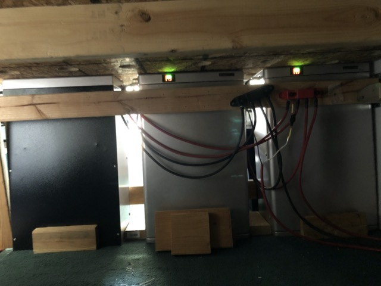
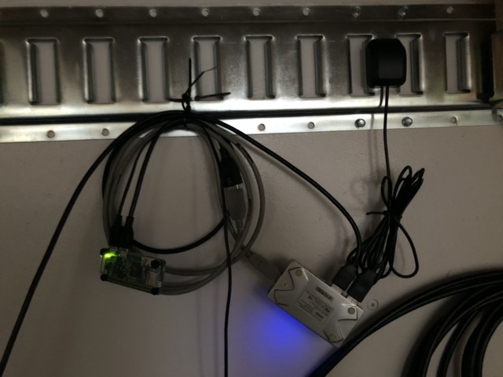
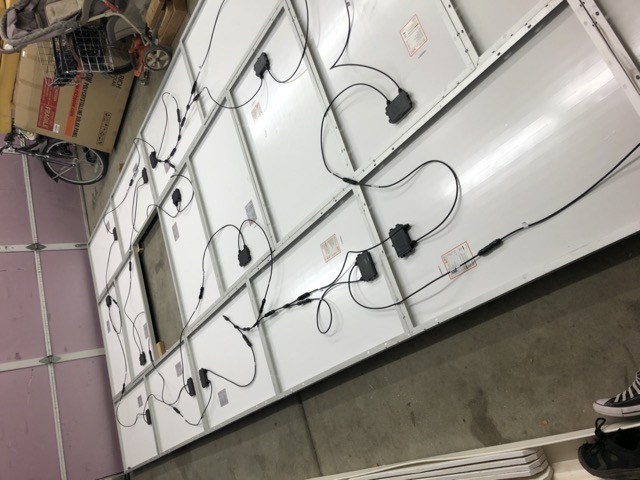

# Trailer Build

## Introduction

It's an 8'x20' car hauler, converted into a travel trailer. Commercially available travel trailers are poorly built, leak, and fall apart. Utility trailers don't have any of these problems. I expect this thing to last forever.

We didn't want to cut holes in the frame or skin, so we built a false wall on the back. This quickly became our main entrance/exit as it's much nicer than the side door on the trailer.

If I could change one thing, I would start with a lighter trailer. Car haulers have massive floor joists which just add unnecessary weight for a travel trailer.

## Construction

## First floor plan

## Final floor plan

### Overview

### Sleeping

### Kitchen

### Bathroom

## Electrical

### Batteries

### Inverter/Charger

### Wiring

48 volt wiring connection inverter/charger to batteries

48v to 12v buck converter and fuses power fan, lighting, and break-away switch fro trailer brakes.

### Solar

## AC/Heat

## Internet

