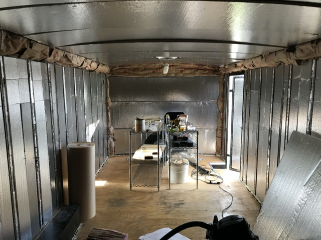
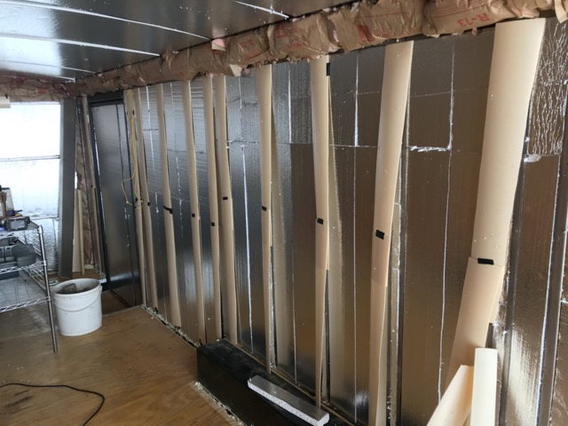
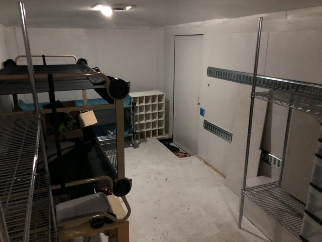

# Trailer Build

## Introduction

It's an 8'x20' car hauler, converted into a travel trailer.

If I could change one thing, I would start with a lighter trailer. Car haulers have massive floor joists which just add unnecessary weight for a travel trailer. However, commercially manufactured travel trailers are poorly built, leak, and fall apart. Utility trailers don't have any of these problems. I expect this thing to last forever.

## Construction

The first thing we did was take all the paneling out and add insulation. 1" solid foam in the walls. 1.5" solid foam in the nose and roof. Batting in the curved corners.

Then we covered all the exposed metal with foam strips. This cuts down on heat loss due to conduction through the walls.

Then put the paneling back in.

A layer of paint and install e-track. E-track gives us flexibility to play with different floor plans.

We boxed around the wheel wells to provide support and insulation. And installed the joists for our bed.

I got ahead of myself and had to take the bed and e-track out to finish painting.

## First floor plan

Our initial floor plan had the queen bed at the back, the kitchen in the middle, and the bunk cots in an "L" shape at the front. This worked ok, but we couldn't really use the back door, and the side door was a little congested.

It also put a lot of "under bed storage" at the tail, which isn't where you want the majority of your weight.

## Final floor plan

### Overview

We wanted more light, and a second door, but we didn't want to cut holes in the frame or skin. So we built a false wall on the back. This quickly became our main entrance/exit as it's much nicer than the side door on the trailer.

Plans for the back wall are in [Trailer Wall.skp](./Trailer%20Wall.skp).

This is looking in the back door. We went with a bunkhouse layout.

Looking back from the front.

And here's the side door, on the passenger's side, with a "walk through" screen.

### Sleeping

At the front driver's side, we have a queen size bed, with lots of storage space underneath.

At the back driver's side, we have full size disc-o-bed bunk cots for the teenagers.

And on the passenger's side, slightly shorter "kid size" disc-o-bed bunk cots for the younger ones.

Raising these up gives lots of storage underneath. They're tied back to the e-track so they won't fall off.

### Kitchen

In the middle driver's side, we have our kitchen, including an 1800w induction cooktop. I didn't want to deal with winterizing, so jugs for water; no plumbing.

The curtains run on a PVC pipe frame to let us separate the space into 3 distinct rooms for privacy when needed, but easily fold away for an open feel. We love having that flexibility to change the space as needed.

The folding table stores here during travel.

In the middle passenger's side, we have the pantry. The 2x6 is the lever I use to check trailer tongue weight. It stores here when traveling to lock bins in place.

Also on passenger side, between the pantry and the side door, we have our freezer, mirror, and our "grab and go" storage for coats and packs.

### Bathroom

I've dealt with black water tanks before. They're the worst. A simple composting toilet is much nicer. The extra bucket lid is full of wood chips to eliminate odor.

Having everything portable lets us set it up in an outdoor pop-up during the day, or in the middle curtain room at night. It's also easy to throw the whole tote in the truck when we need to empty it, or take a toilet with us on a day adventure.

The whole setup stores here on the driver's side during travel.

## Electrical

### Batteries

Under the foot of the queen bed, I have 3 48v Li-ion batteries. Each of these is 79 amp hours. That makes a total of over 11 kwh, or the equivalent of 950 amp hours at 12v.

I used to have these right at the front of the camper, under the head of the queen bed. They are heavy. And having them there pushed my tongue weight too high. Moving them back 5 ft shaved about 200 lbs off the tongue weight. In their new position, I had to build bracing around them to ensure they don't move during travel.

### Inverter/Charger

On the driver's side, just in front of the batteries, I have a Growatt 3kw 48v all-in-one charger/inverter. This connects to solar, batteries, AC in, and AC out. It intelligently routes and converts power between these systems.

The charger/inverter has a USB modbus interface. I use a raspberry pi zero-w to monitor data from the charger/inverter. It also monitors location/speed data from a USB GPS receiver. The raspberry pi is a flexible platform that I can easily extend in the future to add additional monitoring and controls.

All of this data is made available to an iOS app via a websockets interface.

The raspberry pi also has a VPN client running, connecting back to my own VPN server. This allows me to connect to the pi from anywhere using a client-to-client VPN connection.

The code running on the raspberry pi can be found at [https://github.com/joshgubler/trailer-monitor-rpi/](https://github.com/joshgubler/trailer-monitor-rpi/).

The code for the iOS app can be found at  [https://github.com/joshgubler/trailer-monitor-ios/](https://github.com/joshgubler/trailer-monitor-ios/).

### Wiring

The batteries are connected to the charger/inverter in parallel via 4 awg cables and 250 amp busbars. All cables had to be the same length to ensure that the batteries all get the same charge.

At the front of the trailer, a buck converter steps the 48v power down to 12v. A 100 amp busbar and fuses connect this power to the existing trailer wiring for the fan, lighting, and break-away switch for trailer brakes.

I chose to put this close to where the existing trailer wiring ties in, so that I could use lighter gauge wire to the buck converter. (The same load uses less amps at 48v than at 12v.)

### Solar

On the roof, I built a rack to which I mounted 20 100w solar panels. The rack is bolted to the trailer frame through the sides of the trailer so that nothing punctures the roof.

Plans for the solar rack and layout are in [Trailer Solar.skp](./Trailer%20Solar.skp).

I laid everything out in my garage to figure out how everything needed to bolt together, and to figure out wiring.

You can trade amps for volts based on how you wire the panels. I needed to find a configuration that provided more than 48v (my battery voltage) and less than 150v (the max rating of my charger).

I wired the panels into strings of 5 in series, and then 4 strings in parallel (5s4p). This gives me about 20 amps and 100v at peak production.

I considered removing the fan vent cover from the roof of the trailer, adding a 21st panel, and doing a 7s3p configuration. But this would have put the system at 140v, and that's just too close to the 150v max (especially since panels often overproduce when they are cold).

Apparently my panels collect dirt.

## AC/Heat

I mounted a pioneer mini split air conditioner and heat pump on the front of the trailer. The bracket is bolted to the trailer frame. All of the wiring and freon lines run down the outside of the trailer and enter through holes in the floor, so that the walls stay waterproof.

Plans for the mounting bracket are in [Trailer AC Bracket.skp](./Trailer%20AC%20Bracket.skp)

The indoor unit for the mini split is mounted on passenger side of the front wall. Below the mini split is a small washing machine.

The mini split draws about 1000 watts when it's working hard. Once everything gets to temperature, and it's just maintaining, draw drops to about 400 watts. This was the most important factor in determining solar and battery capacity.

With this setup, I can run the mini split in either heat or cool mode 24/7 as long as I get enough sunlight during the day. (I can also use a generator or plug in to campground power if needed.)

## Internet

For internet, I use an [Instyconnect Mobile Internet Router](https://instyconnect.com). This device is comparable in price to other options, but uses newer and much higher quality components. The Instyconnect also organizes those components in a much better configuration than other options, minimizing inherent signal loss.

The antenna and modem are attached to the AC mounting bracket outside the trailer.

The wifi router is inside the trailer and is connected to the 12v busbars.

## Conclusion

We've had a lot of fun working on this project. As you can see, it isn't finish carpentry. But it's flexible and it meets our needs. There have been fun problems to solve, and we've learned a ton. As I said earlier, the one thing I would change would be to start with a lighter trailer.

It'll be a great home base for the many adventures we have planned.
